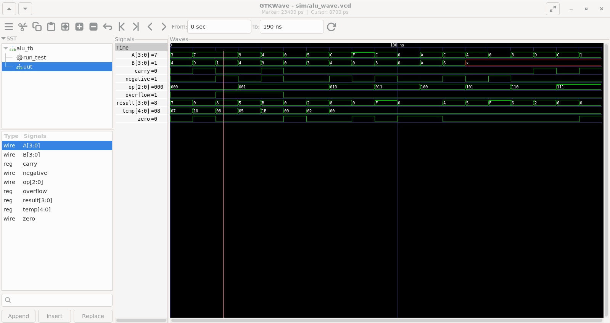

# 01 — 4-bit ALU

A 4-bit Arithmetic Logic Unit (ALU) implemented in Verilog.  
Supports 8 operations with carry, overflow, zero, and negative flags.

## Operations

| `op` | Operation | Description          |
|------|-----------|----------------------|
| 000  | ADD       | A + B                |
| 001  | SUB       | A − B                |
| 010  | AND       | A & B                |
| 011  | OR        | A \| B               |
| 100  | XOR       | A ^ B                |
| 101  | NOT       | ~A (B ignored)       |
| 110  | SHL       | A << 1 (logical)     |
| 111  | SHR       | A >> 1 (logical)     |

## Flags

| Flag       | Condition                              |
|------------|----------------------------------------|
| `zero`     | Result is `0000`                       |
| `carry`    | Carry/borrow out (ADD/SUB), shifted bit (SHL/SHR) |
| `overflow` | Signed overflow (ADD/SUB only)         |
| `negative` | MSB of result is `1`                   |

## File Structure

```
01_alu/
├── src/
│   └── alu.v          # ALU module
├── tb/
│   └── alu_tb.v       # Testbench
├── sim/               # Generated: compiled binary + .vcd waveform
├── Makefile
└── README.md
```

## Simulate

```bash
make sim      # compile + run testbench (prints PASS/FAIL for each case)
make wave     # open waveform in GTKWave
make clean    # remove sim/ artifacts
```

## Block Diagram

```
        A[3:0] ──┐
                  ├──► [ ALU ] ──► result[3:0]
        B[3:0] ──┤              ──► zero
                  │              ──► carry
        op[2:0] ─┘              ──► overflow
                                 ──► negative
```

## Simulation Results

All 19 test cases pass across all 8 operations.

### Terminal Output
See full log: [docs/simulation_log.txt](./docs/simulation_log.txt)

### Waveform


Each segment corresponds to one test case. Signals A, B, op, and result 
change every 10ns as the testbench cycles through all 8 operations.
